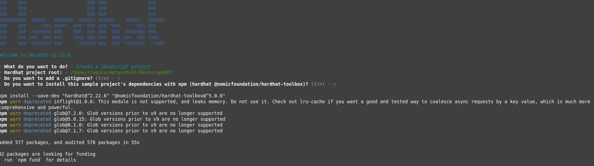

# Horoscope Project

## Setting Up the Environment
   Welcome back, folks! So we learned the importance of building this Horoscope project. Kudos! In this lesson, we will set up the environment required to build our project.So get ready to set up the project and install all the dependencies. Brace yourself and fire up your terminal. We will be running a handful of commands.

## Install HardHat
    First, make a project directory where you will work and we will install all the dependencies and hardhat there.Now open your terminal and run the following commands one by one. Just copy and paste one by one.

    This project demonstrates a basic Hardhat use case. It comes with a sample contract, a test for that contract, and a Hardhat Ignition module that deploys that contract.
    ```bash
    mkdir HoroscopeNFT
    cd HoroscopeNFT
    npm install --save-dev hardhat@2.20.0
    ```
    The above commands mean that you created a HoroscopeNFT folder - an empty one. You entered that folder and initialized the project by making a package.json file. Then you installed hardhat in the same folder.If you have followed the instructions properly, and everything went according to the plan, you have HardHat installed.Now write the following command on the terminal
    ```bash
    npx hardhat init
    ```

    Create a JavaScript project. Just follow through the questions and answer them yes. For me, it was something like this:
    

    We will also install a smart contracts library called OpenZeppelin. It will make it easy for us to develop, run, and ship smart contracts.
    ```bash
    npm install @openzeppelin/contracts
    ```


### Hardhat Help
```shell
npx hardhat help
npx hardhat test
REPORT_GAS=true npx hardhat test
npx hardhat node
npx hardhat ignition deploy ./ignition/modules/Lock.js
```
